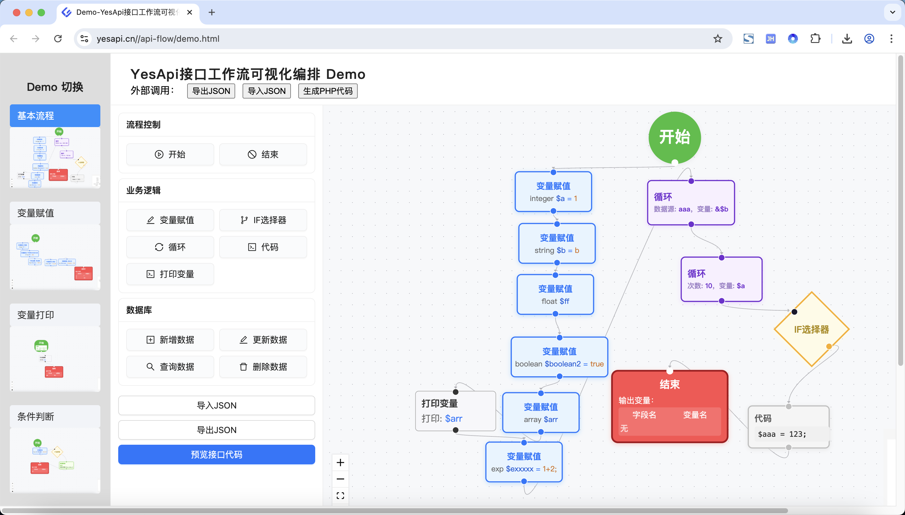
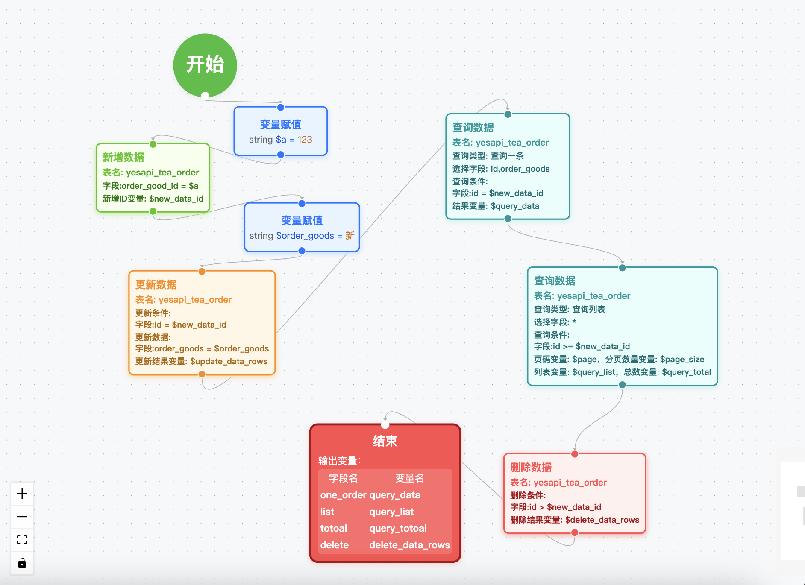

# API Flow Visualizer

[](https://opensource.org/licenses/MIT)
[](https://github.com/yourusername/api-flow-visualizer/pulls)
  
一个开源的 API 流程可视化编排组件，帮助开发者直观地可视化编排和管理 API 工作流逻辑，最终生成可支持的PHP代码。
  
> 本项目 99.9%的代码由AI（[Cursor](https://www.cursor.com/)编辑器）编写，可能是首个使用AI开发的开源前端项目。  


## 在线演示Demo
YesApi接口工作流可视化编排 Demo：https://www.yesapi.cn//api-flow/demo.html  

示例截图：  
  

变量打印：  
  

数据库操作：  
  

条件判断：  
  

循环引用：  
  

## ✨ 核心特性

- 🎨 可视化流程编排
- 🔄 流程控制：开始节点、结束节点
- 📦 业务逻辑：变量赋值、IF选择器、循环、代码、打印变量
- 🛠 数据库：新增数据、更新数据、查询数据、删除数据
- 📱 导入/导出 JSON数据，方便保存和重新编辑
- 🌐 预览和生成PHP代码，基于[PhalApi](https://www.phalapi.net/)开源接口框架（可自行改造成自己的PHP框架）

## 📦 运行

```bash
# npm安装
$ npm install

# 本地运行
$ npm run dev

# 打包成组件（生成dist目录）
$ npm run build:lib
```

## 🚀 快速使用
```html
<!-- 引入打包后的文件 -->
<link href="./api-flow-visualizer.css" rel="stylesheet">
<script src="./api-flow-visualizer.umd.js"></script>

<!-- 可视化编排 -->
<div id="flow-editor"></div>

<script>
const EditorClass = window.ApiFlowVisualizer.default || window.ApiFlowVisualizer;
editor = new EditorClass({
  container: document.getElementById('flow-editor'),
  initialData: {},
  onSave: (json) => { console.log('保存的数据:', json); },
  onGenerateCode: (phpCode) => { console.log('生成的 PHP 代码:', phpCode); }
});
</script>
```

> TODO：npm 包使用的方式待提供。

## 📚 文档

### API接口

```typescript
class ApiFlowVisualizer {
  // 获取当前 JSON 数据
  getJson(): any;
  
  // 生成 PHP 代码
  generatePhpCode(): string;
  
  // 设置数据
  setData(json: any): void;
  
  // 销毁实例
  destroy(): void;
}
```

## 🛠 前端技术栈

- [ReactFlow](https://reactflow.dev/)
- [Ant Design](https://ant.design/components/overview/)
- Node v18.20.4
- React 18
- TypeScript
- Vite
- ESLint
- Prettier

## 🛠 项目开发计划

> 站在巨人的肩膀上开源和创作：功能参考模仿 扣子coze工作流业务逻辑编排、落地应用 果创云YesApi低代码开发平台、AI开发 Cursor编辑器。  

 - 20250517：第一版MVP开源，用AI完成框架搭建以及核心基础功能的开发；  
 - TODO：npm包的打包方式
 - TODO：循环体的可视化编排，支持画布嵌套以及PHP代码生成引擎的调整；
 - TODO：IF判断节点的可视化编排，支持画布嵌套以及PHP代码生成引擎的调整；
 - TODO：数据库操作联动动态的数据库表和表字段数据；

## 👥 贡献者

感谢为本项目做出贡献的AI和开发者！

小彩蛋：我和Cursor一起结对编程的”工作照“。  
  

<a href="https://github.com/yourusername/api-flow-visualizer/graphs/contributors">
  
</a>

## 📞 联系我们

- 项目维护者：DogstarHuang
- 微信：dogstarhuang
  

## ⭐ 支持我们

如果这个项目对你有帮助，欢迎给我们一个 star ⭐️


